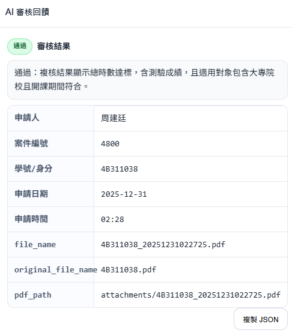

# Prompt Refine

一個以 AI 進行評分與回饋的系統，概念源自 Double Prompt。支援讀取 PDF、產生評分與建議，並將評分紀錄保存到 SQLite。



## 功能摘要

- PDF 內容讀取與整理
- AI 產出評分與回饋
- 評分紀錄保存到 SQLite
- 簡單的前端介面（HTML/CSS/JS）
- 影像切塊 + 重疊 + 融合 API（支援偵測框與分割機率圖融合）

## 技術棧

- Backend: Python + Flask
- Frontend: HTML/CSS/JS（Docker 模式由 Nginx 提供靜態檔案）
- Database: SQLite

## 專案結構

```
backEnd/        後端服務與 AI 流程
frontEnd/       前端靜態頁面
tests/          測試
image/          README 圖片
```

## 快速開始

### 方式 1：Docker（建議）

```cmd
docker compose up --build
```

- Backend: http://localhost:5000
- Frontend: http://localhost:8080

### 方式 2：本機開發（Windows）

1. 啟用虛擬環境（如使用 `gaienv`）

```cmd
call gaienv\env\Scripts\activate.bat
```

2. 安裝後端套件並啟動服務

```cmd
cd backEnd
pip install -r requirements.txt
set OPENAI_API_KEY=your_api_key_here
python app.py
```

3. 開啟前端頁面

- 直接開啟 `frontEnd\public\index.html`
- 或使用指令快速開啟

```cmd
start "" frontEnd\public\index.html
```

### 快速腳本

- `run-backend.bat`：啟動後端
- `run-frontend.bat`：開啟前端頁面
- `run-tests.bat`：執行測試

## 環境變數

請複製 `.env.example` 為 `.env` 並填入：

```
OPENAI_API_KEY=your_openai_api_key_here
SECRET_KEY=please_set_a_secure_random_value
FLASK_ENV=development
DEBUG=True
```

## 部署建議

- 使用 `docker-compose.prod.yml` 進行正式部署
- 不要提交 `.env`；正式環境請用 secrets 或 CI/CD 變數管理

## 其他文件

- 變更紀錄：`CHANGELOG.md`
- 貢獻指南：`CONTRIBUTING.md`

## 影像切塊與融合 API

### 1) 產生切塊座標

`POST /api/vision/tiles`

Request:

```json
{
  "imageWidth": 4032,
  "imageHeight": 3024,
  "tileWidth": 1024,
  "tileHeight": 1024,
  "overlapX": 192,
  "overlapY": 192
}
```

Response (節錄):

```json
{
  "tileCount": 20,
  "tiles": [
    { "tileId": "t0", "x": 0, "y": 0, "width": 1024, "height": 1024, "x2": 1024, "y2": 1024 }
  ]
}
```

### 2) 融合切塊偵測框

`POST /api/vision/fuse/detections`

Request:

```json
{
  "iouThreshold": 0.5,
  "scoreThreshold": 0.2,
  "tilePredictions": [
    {
      "tileId": "t3",
      "x": 832,
      "y": 0,
      "detections": [
        { "bbox": [180, 210, 320, 360], "score": 0.93, "label": "defect" }
      ]
    }
  ]
}
```

Response (節錄):

```json
{
  "count": 1,
  "detections": [
    { "bbox": [1012.2, 210.0, 1152.1, 360.4], "score": 0.93, "label": "defect", "sources": ["t3"] }
  ]
}
```

### 3) 融合切塊分割機率圖

`POST /api/vision/fuse/mask`

Request:

```json
{
  "imageWidth": 2048,
  "imageHeight": 2048,
  "threshold": 0.5,
  "tileProbabilityMaps": [
    { "x": 0, "y": 0, "probability": [[0.1, 0.9], [0.2, 0.8]] }
  ]
}
```

Response:

```json
{
  "probability": [[...]],
  "mask": [[0, 1], [0, 1]]
}
```

### 4) 後端直接串模型 callback

```python
from PIL import Image
from promptrefine.services import TilingConfig, run_tiled_detection_inference

img = Image.open("sample.jpg").convert("RGB")

def my_predictor(tile_image, tile_meta):
    # 回傳 tile local 座標
    return [
        {"bbox": [100, 120, 220, 260], "score": 0.91, "label": "defect"}
    ]

result = run_tiled_detection_inference(
    img,
    my_predictor,
    config=TilingConfig(tile_width=1024, tile_height=1024, overlap_x=192, overlap_y=192),
    iou_threshold=0.5,
    score_threshold=0.2,
)
print(result["detections"])
```
